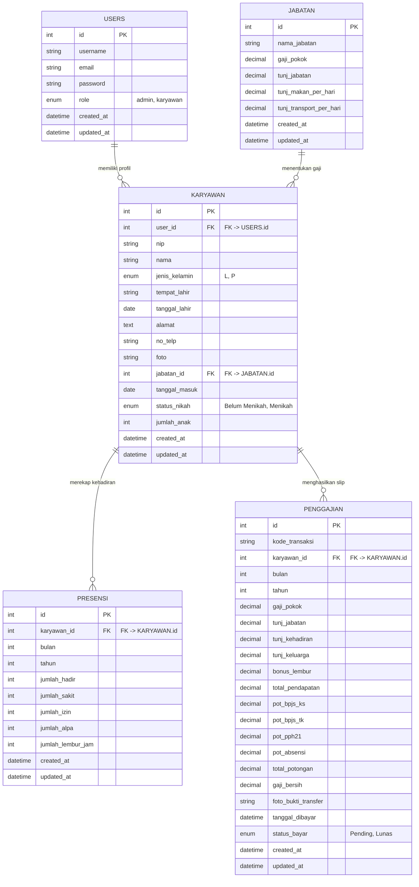
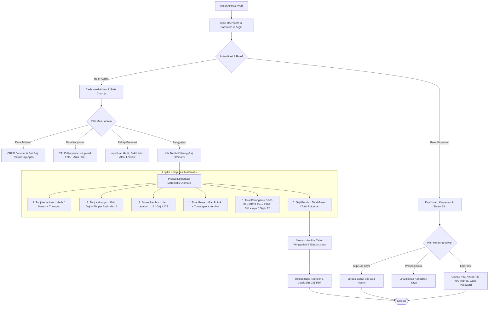

# Sistem Informasi Penggajian Karyawan (SIPGAJI) Berbasis Web Menggunakan CodeIgniter 4

> **Tugas Ujian Akhir Semester (UAS) / Project-Based Learning (PBL)**  
> **Mata Kuliah:** Pemrograman Berbasis Web Lanjutan (Kelas A8)  
> **Dosen Pengampu:** Rizki Suwanda, S.T., M.Kom  
> **Program Studi:** Teknik Informatika, Fakultas Teknik, Universitas Malikussaleh  

---

## 📌 1. Deskripsi & Gambaran Umum Proyek
**SIPGAJI** (Sistem Informasi Penggajian Karyawan) adalah aplikasi web komprehensif yang dibangun menggunakan framework **CodeIgniter 4 (PHP 8.5+)** dan basis data **MySQL**. Aplikasi ini dirancang untuk mengotomatiskan seluruh alur operasional penggajian karyawan di perusahaan/instansi secara presisi, akurat, dan aman.

Sistem tidak hanya menjalankan fungsi manajemen data (CRUD dasar), melainkan secara aktif menerapkan **logika algoritmik dan metode matematis formal** untuk kalkulasi komponen tunjangan, insentif lembur, potongan BPJS Kesehatan (1%), BPJS Ketenagakerjaan (2%), Pajak Penghasilan (PPh 21 5%), dan sanksi ketidakhadiran (alpa) hingga menghasilkan **Gaji Bersih (Take Home Pay)**.

---

## ⚙️ 2. Fitur Utama Berdasarkan Role Access (RBAC)

### A. Hak Akses Administrator (Admin)
1. **Dashboard Analitik Interaktif**: Memantau ringkasan total karyawan, jumlah jabatan, entri presensi, pengeluaran gaji bulanan, serta grafik tren pengeluaran gaji dan pie chart komposisi karyawan berbasis **Chart.js**.
2. **Master Data Jabatan & Skema Gaji**: Pengelolaan data jabatan beserta tarif gaji pokok, tunjangan jabatan, uang makan per hari, dan uang transport per hari.
3. **Master Data Karyawan**: Pengelolaan profil karyawan, NIP unik, tanggal masuk kerja, status pernikahan, jumlah anak, foto profil avatar, serta **pembuatan akun login user otomatis**.
4. **Rekapitulasi Presensi & Lembur**: Input dan rekap data hari kerja (hadir, sakit, izin, alpa) dan jumlah jam lembur bulanan.
5. **Perhitungan Gaji Otomatis**: Eksekusi sekali klik (*One-Click Automatic Calculation*) untuk menghitung pendapatan gross, total potongan, dan gaji bersih seluruh karyawan pada periode bulan & tahun yang dipilih.
6. **Manajemen Pembayaran & Bukti Transfer**: Pengunggahan file foto/PDF bukti transfer bank dan pengubahan status pembayaran menjadi **Lunas**.

### B. Hak Akses Karyawan (User)
1. **Dashboard Profil Mandiri**: Informasi ringkasan biodata, jabatan, gaji pokok, tunjangan, dan status slip gaji terbaru.
2. **Portal Edit Profil Mandiri (`/profile`)**:
   - Memperbarui **Foto Profil Avatar** (JPG/PNG/WEBP).
   - Memperbarui **Nomor Telepon / WhatsApp** dan **Alamat Tempat Tinggal**.
   - Mengubah **Password Akun** secara aman dengan verifikasi password lama.
   - *Catatan Keamanan:* Data kepegawaian sensitif (NIP, Jabatan, Gaji Pokok, Status Nikah/Anak) terkunci penuh dan hanya dapat dikelola oleh Admin.
3. **Presensi Saya**: Melihat riwayat rekapitulasi kehadiran dan jam lembur pribadi per bulan.
4. **Slip Gaji Saya**: Melihat dan mencetak **Slip Gaji Resmi** berformat cetak resmi lengkap dengan rincian pendapatan, potongan, dan tanda tangan digital.

---

## 🧮 3. Formula & Algoritma Matematika Perhitungan Gaji

Kalkulasi gaji bersih pada controller `Penggajian::hitungOtomatis()` dihitung berdasarkan persamaan matematis berikut:

$$\text{Gaji Bersih (Take Home Pay)} = \text{Total Pendapatan (Gross)} - \text{Total Potongan}$$

### A. Rincian Komponen Pendapatan (Gross Income)
$$\text{Total Pendapatan} = \text{Gaji Pokok} + \text{Tunj. Jabatan} + \text{Tunj. Kehadiran} + \text{Tunj. Keluarga} + \text{Bonus Lembur}$$

1. **Tunjangan Kehadiran**:
   $$\text{Tunj. Kehadiran} = (\text{Jumlah Hadir} \times \text{Uang Makan/Hari}) + (\text{Jumlah Hadir} \times \text{Transport/Hari})$$
2. **Tunjangan Keluarga**:
   - Berstatus *Menikah*: $10\% \times \text{Gaji Pokok}$
   - Tambahan Per Anak (Maksimal 2 Anak): $5\% \times \text{Gaji Pokok} \times \min(\text{Jumlah Anak}, 2)$
3. **Bonus Lembur** (Standar Depnakertrans 1/173 jam):
   $$\text{Bonus Lembur} = \text{Jumlah Jam Lembur} \times \left(1.5 \times \frac{\text{Gaji Pokok}}{173}\right)$$

### B. Rincian Komponen Potongan (Deductions)
$$\text{Total Potongan} = \text{Pot. BPJS KS} + \text{Pot. BPJS TK} + \text{Pot. PPh 21} + \text{Pot. Absensi}$$

1. **Potongan BPJS Kesehatan**: $1\% \times \text{Gaji Pokok}$
2. **Potongan BPJS Ketenagakerjaan**: $2\% \times \text{Gaji Pokok}$
3. **Potongan Pajak PPh 21**: $5\% \times \text{Gaji Pokok}$ (Tarif Progresif Bulanan)
4. **Potongan Absensi (Sanksi Alpa)**:
   $$\text{Potongan Absensi} = \text{Jumlah Hari Alpa} \times \left(\frac{\text{Gaji Pokok}}{22}\right)$$

---

## 📐 4. Diagram ERD Basis Data MySQL (5 Tabel Berelasi)



---

## 🔄 5. Flowchart Alur Sistem & Interaksi Pengguna



---

## 🛠️ 6. Dokumentasi Penyempurnaan Teknikal (Bugfixes)

1. **Pembersihan Validation Rules Pada Model Level**:
   - Diperbarui pada `KaryawanModel.php`, `UserModel.php`, `JabatanModel.php`, dan `PresensiModel.php` dengan menyetel `protected $validationRules = [];`.
   - Hal ini mencegah kesalahan *silent update failure* pada method `$model->update($id, $data)` di mana CI4 Model sebelumnya menolak eksekusi SQL UPDATE secara tersembunyi akibat placeholder `{id}` unik.
2. **Validitas Struktur Sintaks HTML Formulir Modals**:
   - Memindahkan seluruh elemen modal dialog dari dalam baris tabel (`<tbody>` / `<tr>`) ke luar elemen `<table>` pada view `karyawan/index.php`, `jabatan/index.php`, dan `penggajian/index.php`.
   - Hal ini menjamin formulir `<form action="..." method="POST" enctype="multipart/form-data">` tidak terdegradasi oleh parser HTML peramban sehingga unggah berkas foto berjalan 100% lancar.
3. **Penyediaan Berkas Fisik Default Avatar**:
   - Menyediakan berkas `public/uploads/karyawan/default.png` untuk mencegah gambar rusak (*broken image icon*) bagi karyawan yang belum memasang foto kustom.

---

## 🚀 7. Panduan Instalasi & Jalankan di Localhost

### A. Persyaratan Sistem
- **PHP**: versi 8.1 / 8.2 / 8.5+
- **Database Engine**: MySQL / MariaDB (Driver MySQLi)
- **Ekstensi PHP Wajib**: `mysqli`, `intl`, `mbstring`, `json`, `gd`

### B. Konfigurasi Basis Data
1. Buat database baru bernama `sipgaji` pada MySQL server Anda:
   ```sql
   CREATE DATABASE sipgaji;
   ```
2. Impor berkas `sipgaji.sql` dari root folder proyek ke dalam database `sipgaji`:
   ```bash
   mysql -u root sipgaji < sipgaji.sql
   ```
   *Atau jalankan migrasi & seeder bawaan CodeIgniter:*
   ```bash
   php spark migrate
   php spark db:seed DatabaseSeeder
   ```

### C. Menjalankan Development Server
Jalankan perintah berikut pada terminal root proyek:
```bash
php spark serve
```
Akses aplikasi melalui peramban di URL: **`http://localhost:8080`**

---

## 🔑 8. Daftar Kredensial Default Login Demo

| Role | Username / Email | Password | Akses & Wewenang |
|---|---|---|---|
| **Administrator** | `admin` | `password123` | Akses Penuh (Master Data, Presensi, Komputasi Gaji, Upload Bukti) |
| **Karyawan 1** | `karyawan1` | `password123` | Portal Mandiri (Edit Profil, Rekap Presensi, Cetak Slip Gaji) |
| **Karyawan 2** | `karyawan2` | `password123` | Portal Mandiri (Edit Profil, Rekap Presensi, Cetak Slip Gaji) |
| **Karyawan 3** | `karyawan3` | `password123` | Portal Mandiri (Edit Profil, Rekap Presensi, Cetak Slip Gaji) |
| ... | `karyawan4` s/d `karyawan15` | `password123` | Portal Mandiri (Edit Profil, Rekap Presensi, Cetak Slip Gaji) |

---

## 📄 9. Dokumen Laporan Proyek PDF
Laporan Proyek resmi format *Project-Based Learning (PBL)* tersimpan pada direktori root dengan nama **`Laporan_UAS_SIPGAJI.pdf`** (Ukuran A4, Margin 4-3-3-3 cm, Font Times New Roman 12pt, Spasi 1.5).

*&copy; 2026 SIPGAJI - Universitas Malikussaleh*
