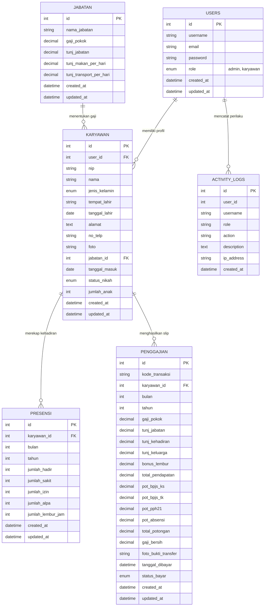

# Sistem Informasi Penggajian Karyawan (SIPGAJI) Berbasis Web Menggunakan CodeIgniter 4

> **Tugas Ujian Akhir Semester (UAS) / Project-Based Learning (PBL)**  
> **Mata Kuliah:** Pemrograman Berbasis Web Lanjutan (Kelas A5)  
> **Kelompok:** **TIM - B**  
> **Dosen Pengampu:** Rizki Suwanda, S.T., M.Kom  
> **Program Studi:** Teknik Informatika, Fakultas Teknik, Universitas Malikussaleh  
> **Live Demo Hosting:** [http://sipgaji.fwh.is/](http://sipgaji.fwh.is/)  
> **Repository GitHub:** [https://github.com/MuslimGunawan/sipgaji.git](https://github.com/MuslimGunawan/sipgaji.git)  

---

## 👥 Tim Kelompok (TIM - B)

| No | Nama Anggota | NIM | Peran & Tanggung Jawab |
|---|---|---|---|
| 1 | **RAHMI SAHARA** | **240170070** | **Ketua Tim**, Perancangan ERD Database, Konfigurasi CI4 & Migration |
| 2 | **NICOIWAN ADHA KOBAT** | **240170207** | Controller Penggajian & Logika Algoritma Perhitungan Gaji |
| 3 | **AZKAL AZKIYA** | **240170235** | Autentikasi RBAC, Master Data, Audit Log, & Edit Profil Karyawan |
| 4 | **ZAHRA** | **230170012** | Desain Antarmuka Mobile-Responsive Bootstrap 5, SweetAlert2, Chart.js & Slip Gaji |

---

## 📌 1. Deskripsi & Gambaran Umum Proyek
**SIPGAJI** (Sistem Informasi Penggajian Karyawan) adalah aplikasi web komprehensif yang dibangun menggunakan framework **CodeIgniter 4 (PHP 8.5+)** dan basis data **MySQL**. Aplikasi dirancang untuk mengelola data kepegawaian, kehadiran, dan perhitungan gaji karyawan di perusahaan/instansi secara presisi, akurat, dan aman.

Sistem tidak hanya menjalankan fungsi manajemen data (CRUD dasar 50 karyawan real), melainkan secara aktif menerapkan **logika algoritmik dan metode matematis formal** untuk kalkulasi komponen tunjangan, insentif lembur, potongan BPJS Kesehatan (1%), BPJS Ketenagakerjaan (2%), Pajak Penghasilan (PPh 21 5%), dan sanksi ketidakhadiran (alpa) hingga menghasilkan **Gaji Bersih (Take Home Pay)**, dilengkapi dengan Audit Log Aktivitas, Live Instant Search, Notifikasi SweetAlert2, dan Portal Mandiri Karyawan.

---

## ⚙️ 2. Fitur Utama Berdasarkan Role Access (RBAC)

### A. Hak Akses Administrator (Admin)
1. **Dashboard Analitik Interaktif**: Memantau ringkasan total karyawan, jumlah jabatan, entri presensi, pengeluaran gaji bulanan, grafik tren pengeluaran gaji, pie chart komposisi karyawan berbasis **Chart.js**, serta **Widget Log Aktivitas Sistem Terkini**.
2. **Audit Log Aktivitas System (`/activity-logs`)**: Halaman rekam jejak aktivitas real-time yang mencatat seluruh tindakan user (Login, Logout, Add/Edit/Delete Karyawan & Jabatan, Edit Profil, Hitung Gaji, Upload Bukti, dll) dilengkapi filter aksi dan opsi pembersihan log.
3. **Master Data Karyawan & Jabatan**: Pengelolaan profil karyawan, NIP unik, tanggal masuk kerja, status pernikahan, jumlah anak, foto profil avatar, tombol **Modal Eye Detail Karyawan** (kredensial login), serta skema gaji pokok & tunjangan.
4. **Rekapitulasi Presensi & Lembur**: Input dan rekap data hari kerja (hadir, sakit, izin, alpa) dan jumlah jam lembur bulanan.
5. **Instant Live Search & Filter Penggajian**: Pencarian kata kunci instant tanpa reload (JavaScript) & server-side filter GET yang terisolasi aman dari eksekusi perhitungan gaji.
6. **Perhitungan Gaji Otomatis**: Eksekusi sekali klik (*One-Click Automatic Calculation*) untuk menghitung pendapatan gross, total potongan, dan gaji bersih seluruh karyawan pada periode bulan & tahun yang dipilih.
7. **Manajemen Pembayaran & Bukti Transfer**: Pengunggahan file foto/PDF bukti transfer bank dan pengubahan status pembayaran menjadi **Lunas**.
8. **Notifikasi Custom SweetAlert2**: Penggantian dialog *confirm()* bawaan browser dengan modal dialog pop-up modern SweetAlert2 yang elegan.

### B. Hak Akses Karyawan (User)
1. **Dashboard Profil Mandiri**: Informasi ringkasan biodata, jabatan, gaji pokok, tunjangan, dan status slip gaji terbaru.
2. **Portal Edit Profil Mandiri (`/profile`)**:
   - Memperbarui **Foto Profil Avatar** (JPG/PNG/WEBP).
   - Memperbarui **Nomor Telepon / WhatsApp** dan **Alamat Tempat Tinggal**.
   - Mengubah **Password Akun** secara aman dengan verifikasi password lama.
3. **Presensi Saya**: Melihat riwayat rekapitulasi kehadiran dan jam lembur pribadi per bulan.
4. **Slip Gaji Saya & Bukti Bayar**: Melihat dan mencetak **Slip Gaji Resmi** berformat cetak resmi lengkap dengan rincian pendapatan, potongan, tanda tangan digital, serta **akses langsung unduh Bukti Transfer Pembayaran Gaji**.

---

## 🧮 3. Formula & Algoritma Matematika Perhitungan Gaji

Kalkulasi gaji bersih pada controller `Penggajian::hitungOtomatis()` dihitung berdasarkan persamaan matematis berikut:

$$\text{Gaji Bersih (Take Home Pay)} = \text{Total Pendapatan (Gross)} - \text{Total Potongan}$$

### A. Rincian Komponen Pendapatan (Gross Income)
$$\text{Total Pendapatan} = \text{Gaji Pokok} + \text{Tunj. Jabatan} + \text{Tunj. Kehadiran} + \text{Tunj. Keluarga} + \text{Bonus Lembur}$$

1. **Tunjangan Kehadiran**:
   $$\text{Tunj. Kehadiran} = (\text{Jumlah Hadir} \times \text{Uang Makan/Hari}) + (\text{Jumlah Hadir} \times \text{Transport/Hari})$$
2. **Tunjangan Keluarga**:
   - Berstatus *Menikah*: $10\% \times \text{Gaji Pokok}$
   - Tambahan Per Anak (Maksimal 2 Anak): $5\% \times \text{Gaji Pokok} \times \min(\text{Jumlah Anak}, 2)$
3. **Bonus Lembur** (Standar Depnakertrans 1/173 jam):
   $$\text{Bonus Lembur} = \text{Jumlah Jam Lembur} \times \left(1.5 \times \frac{\text{Gaji Pokok}}{173}\right)$$

### B. Rincian Komponen Potongan (Deductions)
$$\text{Total Potongan} = \text{Pot. BPJS KS} + \text{Pot. BPJS TK} + \text{Pot. PPh 21} + \text{Pot. Absensi}$$

1. **Potongan BPJS Kesehatan**: $1\% \times \text{Gaji Pokok}$
2. **Potongan BPJS Ketenagakerjaan**: $2\% \times \text{Gaji Pokok}$
3. **Potongan Pajak PPh 21**: $5\% \times \text{Gaji Pokok}$ (Tarif Progresif Bulanan)
4. **Potongan Absensi (Sanksi Alpa)**:
   $$\text{Potongan Absensi} = \text{Jumlah Hari Alpa} \times \left(\frac{\text{Gaji Pokok}}{22}\right)$$

---

## 📐 4. Diagram ERD Basis Data MySQL (6 Tabel Berelasi)



---

## 📸 5. Galeri Antarmuka Aplikasi (Screenshots)

Berikut adalah dokumentasi tangkapan layar antarmuka utama aplikasi SIPGAJI:

| Fitur / Halaman | Tangkapan Layar (Screenshot) |
|---|---|
| **Halaman Login & Security** |  |
| **Dashboard Admin & Analytics** |  |
| **Master Data Karyawan (Eye Detail)** |  |
| **Master Data Jabatan** |  |
| **Rekapitulasi Presensi** |  |
| **Perhitungan Gaji & Instant Search** |  |
| **Audit Log Aktivitas System** |  |
| **Edit Profil Admin** |  |
| **Dashboard Mandiri Karyawan** |  |
| **Presensi Karyawan** |  |
| **Slip Gaji Karyawan & Bukti Bayar** |  |
| **Cetak Slip Gaji Resmi** |  |
| **Edit Profil Mandiri Karyawan** |  |
| **SweetAlert2 Confirm Modal** |  |
| **SweetAlert2 Flash Toast** |  |
| **Modal Informasi Tim Kelompok B** |  |

---

## 🚀 6. Panduan Instalasi & Jalankan di Localhost

### A. Persyaratan Sistem
- **PHP**: versi 8.1 / 8.2 / 8.5+
- **Database Engine**: MySQL / MariaDB (Driver MySQLi)
- **Ekstensi PHP Wajib**: `mysqli`, `intl`, `mbstring`, `json`, `gd`

### B. Konfigurasi Basis Data
1. Buat database baru bernama `sipgaji` pada MySQL server Anda:
   ```sql
   CREATE DATABASE sipgaji;
   ```
2. Impor berkas `sipgaji.sql` dari root folder proyek ke dalam database `sipgaji`:
   ```bash
   mysql -u root sipgaji < sipgaji.sql
   ```
   *Atau jalankan migrasi & seeder bawaan CodeIgniter:*
   ```bash
   php spark migrate
   php spark db:seed DatabaseSeeder
   ```

### C. Menjalankan Development Server
Jalankan perintah berikut pada terminal root proyek:
```bash
php spark serve
```
Akses aplikasi melalui peramban di URL: **`http://localhost:8080`**

---

## 🔑 7. Daftar Kredensial Default Login Demo

| Role | Username / Email | Password | Akses & Wewenang |
|---|---|---|---|
| **Administrator** | `admin` | `password123` | Akses Penuh (Master Data, Presensi, Komputasi Gaji, Audit Log, Upload Bukti) |
| **Karyawan 1** | `karyawan1` | `password123` | Portal Mandiri (Edit Profil, Rekap Presensi, Cetak Slip, Bukti Bayar) |
| **Karyawan 2** | `karyawan2` | `password123` | Portal Mandiri (Edit Profil, Rekap Presensi, Cetak Slip, Bukti Bayar) |
| **Karyawan 3** | `karyawan3` | `password123` | Portal Mandiri (Edit Profil, Rekap Presensi, Cetak Slip, Bukti Bayar) |
| ... | `karyawan4` s/d `karyawan50` | `password123` | Portal Mandiri (Edit Profil, Rekap Presensi, Cetak Slip, Bukti Bayar) |

---

## 📄 8. Dokumen Laporan Proyek PDF
Laporan Proyek resmi format *Project-Based Learning (PBL)* tersimpan pada direktori root dengan nama **`Laporan_UAS_SIPGAJI.pdf`** (Ukuran A4, Margin 4-3-3-3 cm, Font Times New Roman 12pt, Spasi 1.5).

*&copy; 2026 SIPGAJI - TIM B - Universitas Malikussaleh*
